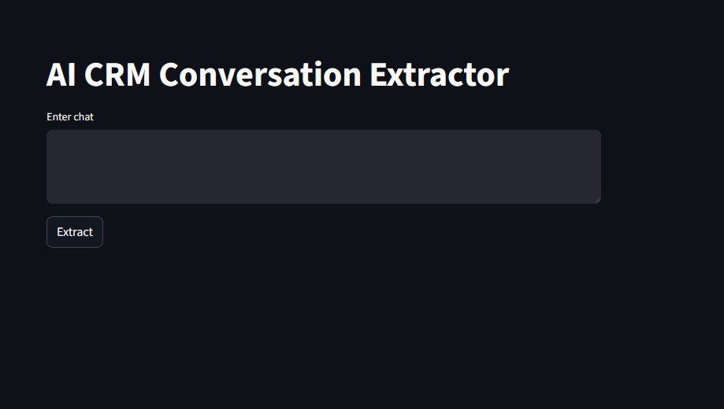
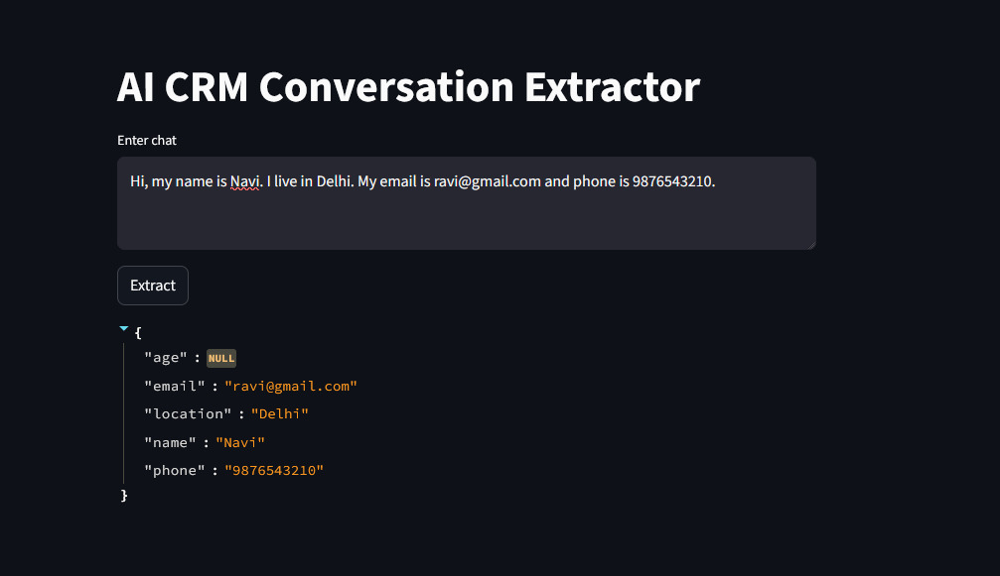

## AI CRM Conversation extractor(LLM-Powered)

## Overview
The **AI CRM Conversation Extractor** is a Python-based system that converts **unstructured chat conversations into structured customer data** using Groq’s Llama 3.1 model.
-- Designed to solve real-world problems like:
- Extracting customer details from messy chat conversations  
- Automating manual CRM data entry  
- Converting chat data into structured business insights 

## Live Demo
 **Live Demo:** [Click here to view](https://crm-talk.streamlit.app/)

## screenshot

## Key Features

- **Conversation Summarization**  
  Automatically summarizes chat history using LLM  

-  **User Information Extraction**  
  Extracts:
  - Name  
  - Email  
  - Phone  
  - Location  
  - Age  

-  **Structured JSON Output**  
  Converts chat into machine-readable format  

  ## What Makes This Project Different?

- Converts raw chat into structured CRM data  
-  Uses LLM (not regex) for context understanding  
-  Outputs clean JSON for real-world usage  
-  Designed for business automation  
- Combines summarization + extraction  

## How It Works

1. Input chat conversation  
2. Process using Groq LLM  
3. Summarize context  
4. Extract user details  
5. Return structured JSON  

## Example
### Input:
Hi, I’m Aman from Delhi. You can reach me at aman@gmail.com or 9876543210.

### Output:
{
  "name": "Aman",
  "email": "aman@gmail.com",
  "phone": "9876543210",
  "location": "Delhi"
}

## Installation

git clone <repository-url>
cd ai-crm-conversation-extractor
pip install openai python-dotenv

## Create a .env file:

GROQ_API_KEY=your_api_key_here

## Usage
streamlit run app.py

##  Project Structure
- `app.py` — Streamlit UI  
- `source/` — Core logic (extractor, config, etc.)  
- `.env` — API key config  
- `README.md` — Documentation  

